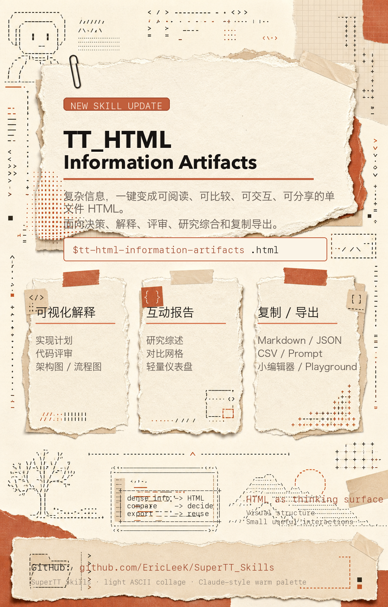

  

# SuperTT Skills

Reusable Codex workflows created by Super TT: turn dense information into useful HTML, or learn an unfamiliar codebase through its structure and data flow.

## Choose a workflow

| When you want to… | Start here |
| --- | --- |
| Explain, compare, inspect, or interact with information | [TT_HTML Information Artifacts](skills/tt-html-information-artifacts/SKILL.md) |
| Understand a codebase and practice changing it | [TT_Vibe Coding Tutor](skills/tt-vibe-coding-tutor/SKILL.md) |

### TT_HTML Information Artifacts

`tt-html-information-artifacts` produces single-file HTML artifacts such as visual explainers, research syntheses, comparison grids, lightweight dashboards, playgrounds, and copy/export tools. The focus is a useful reading or interaction experience.

### TT_Vibe Coding Tutor

`tt-vibe-coding-tutor` starts with a map of the repository, follows data through the system, identifies contracts and extension points, and uses bounded exercises to turn that map into practical understanding.

TT_HTML Information Artifacts poster

  

## Use a skill

Open the relevant `SKILL.md` above and follow its workflow in a compatible coding-agent environment. Each skill is self-contained under [`skills/`](skills/); skill IDs use the `tt-` prefix and display names use `TT_`.

The shared HTML design guidance is in [`HTML-DESIGN-GUIDE.md`](HTML-DESIGN-GUIDE.md).

Static overview

[Open the static SVG](./assets/readme/hero.svg).

